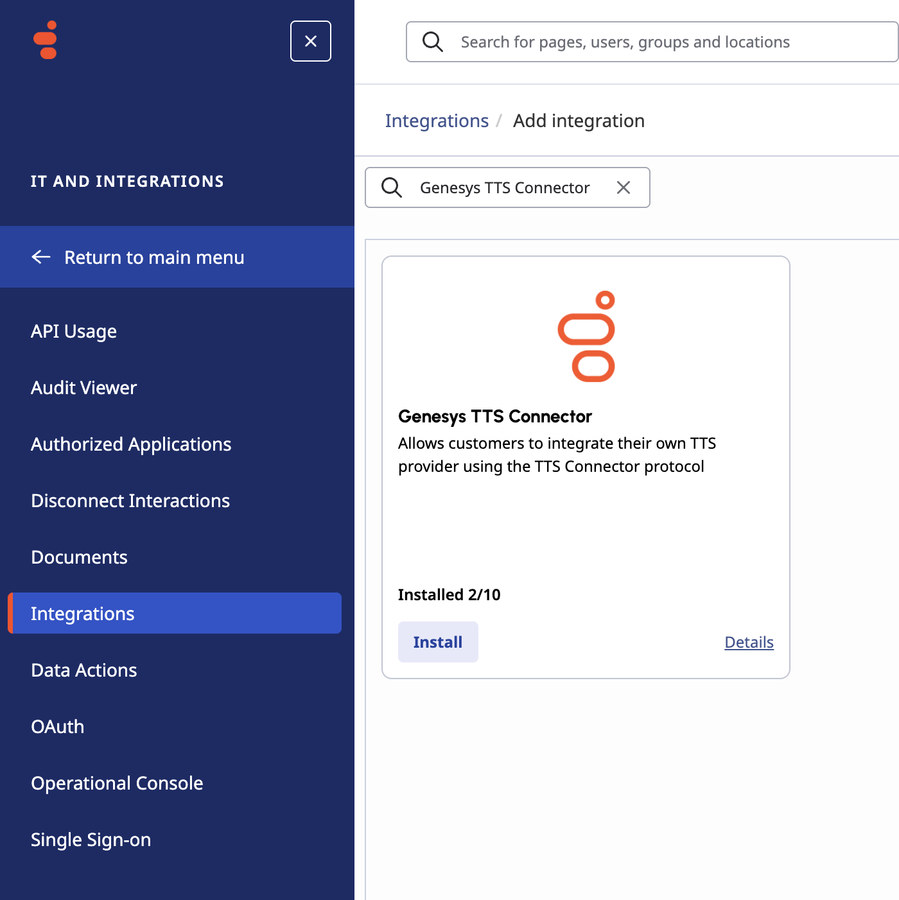
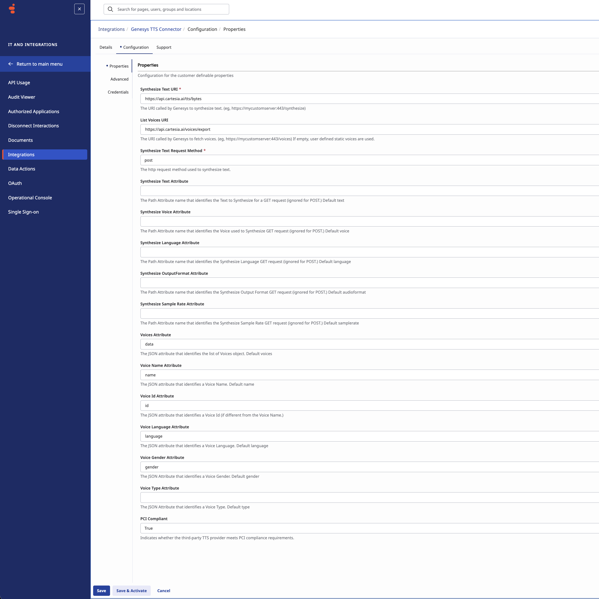
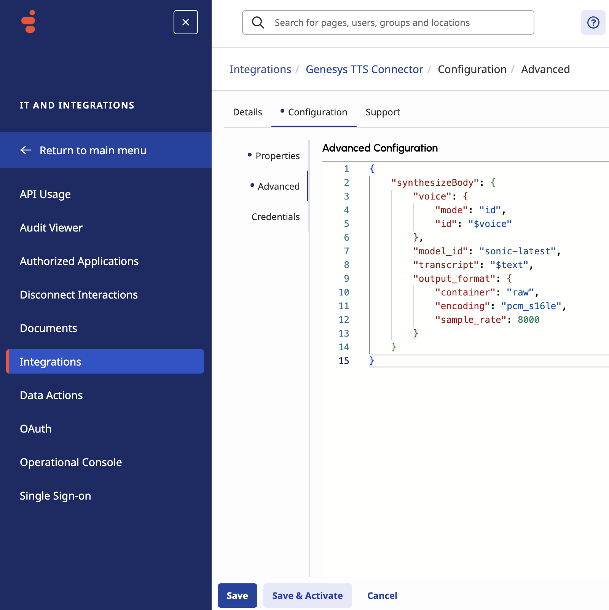
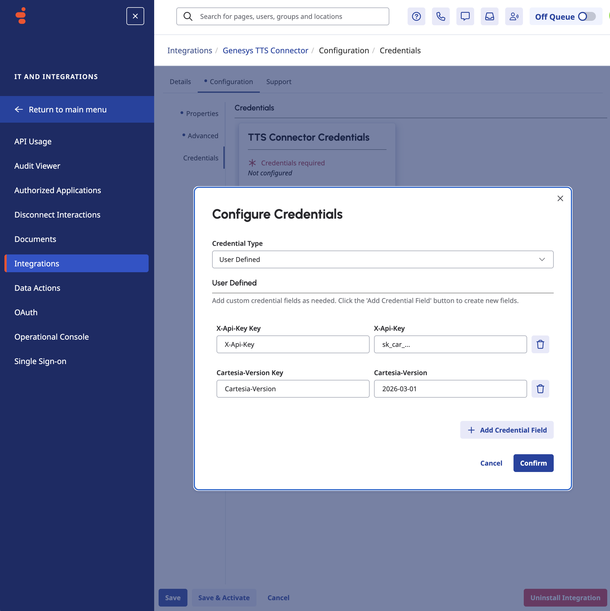
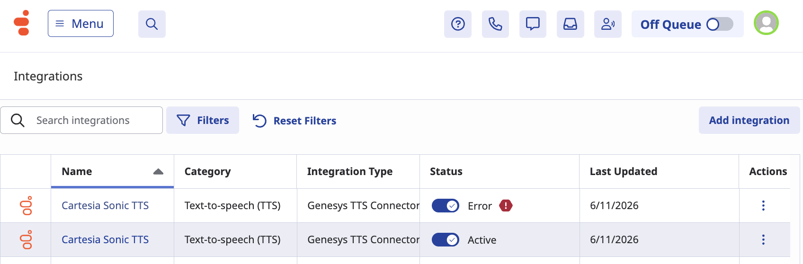
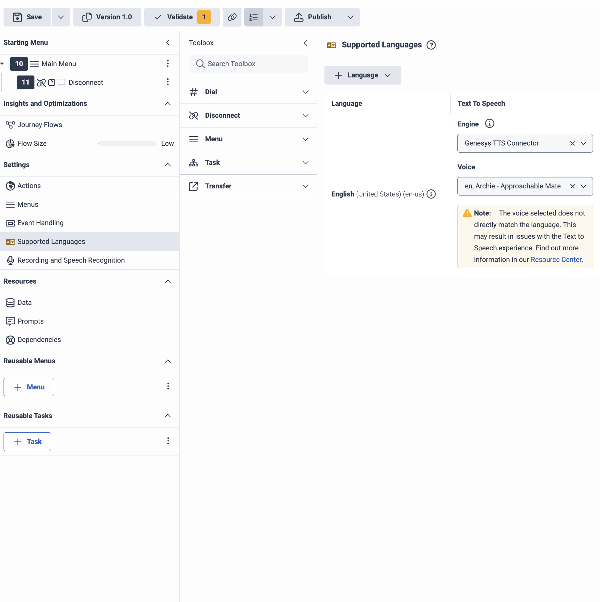

<Check>Last verified: 2026-06-11</Check>

## Overview

Genesys partners with Cartesia for text-to-speech in a few ways,
one of which is the Genesys TTS Connector integration.
This integration is configured in the Genesys Cloud.

## Prerequisites

- A [Cartesia subscription](https://play.cartesia.ai/subscription) using a paid plan
- A [Cartesia API key](https://play.cartesia.ai/keys); looks like `sk_car_...`
- Access to a Genesys Cloud organization where you can install and configure integrations

## Configure the Genesys TTS Connector with Sonic

<Steps>
  <Step title="Open the Genesys TTS Connector integration" titleSize="h3">
    If you did not previously install the integration into your Genesys Cloud organization, install the Genesys TTS Connector now.

    If you already installed the integration:

    1. Click **Menu** > **IT and Integrations** > **Integrations**.
    2. Search for and open the **Genesys TTS Connector** integration.

    <Frame>
      
    </Frame>
  </Step>

  <Step title="Name the integration" titleSize="h3">
    In the **Details** tab, enter a unique name for the integration. This can be anything you want, such as `Genesys TTS Connector: Cartesia`.
  </Step>

  <Step title="Open the Configuration tab" titleSize="h3">
    On the **Genesys TTS Connector: Cartesia** integration page, click **Configuration**.
  </Step>

  <Step title="Configure properties" titleSize="h3">
    Under **Properties**, enter these values:

    | Property name | Value |
    | --- | --- |
    | Synthesize Text URI | `https://api.cartesia.ai/tts/bytes` |
    | List Voices URI | `https://api.cartesia.ai/voices/export` |
    | Synthesize Text Request Method | `post` |
    | Voices Attribute | `data` |
    | Voice Name Attribute | `name` |
    | Voice Id Attribute | `id` |
    | Voice Language Attribute | `language` |
    | Voice Gender Attribute | `gender` |
    | PCI Compliant | `True` |

    <Accordion title="These properties are not used and can be left alone">
      - Synthesize Text Attribute
      - Synthesize Voice Attribute
      - Synthesize Languages Attribute
      - Synthesize OutputFormat Attribute
      - Synthesize Sample Rate Attribute
      - Voice Type Attribute
    </Accordion>

    <Frame>
      
    </Frame>
  </Step>

  <Step title="Set the advanced JSON configuration" titleSize="h3">
    Click **Advanced**, then copy and paste this as the JSON configuration:

    ```json
    {
      "synthesizeBody": {
        "voice": {
          "mode": "id",
          "id": "$voice"
        },
        "model_id": "sonic-latest",
        "transcript": "$text",
        "output_format": {
          "container": "raw",
          "encoding": "pcm_s16le",
          "sample_rate": 8000
        }
      }
    }
    ```

    <Tip>
      1. If these settings generate garbled audio, come back and change `output_format` to match your telephony setup. See [Output Format](/build-with-cartesia/capability-guides/tts-output-audio-format) for details.
      2. Before using Sonic in production, change `sonic-latest` to a dated model snapshot from [TTS models](/build-with-cartesia/tts-models/latest) for stability.
    </Tip>

    <Frame>
      
    </Frame>
  </Step>

  <Step title="Add credentials" titleSize="h3">
    1. Click **Credentials**, then click **Configure**.
    2. In the Configure Credentials dialog, select **Credential Type: User Defined**.
    3. Click **Add Credential Field**, then add these fields:

        | Key | X-Api-Key |
        | --- | --- |
        | `X-Api-Key` | Your API key from [play.cartesia.ai/keys](https://play.cartesia.ai/keys) |

        | Key | Cartesia-Version |
        | --- | --- |
        | `Cartesia-Version` | `2026-03-01` |

    4. Click **Confirm**.

    <Frame>
      
    </Frame>
  </Step>

  <Step title="Save and activate the integration" titleSize="h3">
    Click **Save & Activate**.

    Back on the **Integrations** page, your Genesys TTS Connector integration status should change to **Active** after a few seconds, or show an error.

    <Accordion title="Troubleshooting activation errors">

      | Error message | What it means |
      | --- | --- |
      | You must be logged in to access this endpoint | `X-Api-Key` credential is incorrect |
      | Invalid Cartesia-Version header | `Cartesia-Version` credential is incorrect |
      | `quota_exceeded` | You need to upgrade your Cartesia subscription |
      | Your request was invalid | Something is wrong with **Configuration > Properties** or **Configuration > Advanced** |

    </Accordion>

    <Frame>
      
    </Frame>
  </Step>

  <Step title="Try out Sonic" titleSize="h3">

    On the Genesys Cloud **Architect** page, select your newly configured integration and use it for a **supported language**.

    You can try out different **voices** on the Architect page, or on [play.cartesia.ai/voices](https://play.cartesia.ai/voices).
    See [Choosing a Voice](/build-with-cartesia/capability-guides/choosing-a-voice) for tips.

    <Tip>
    If audio is garbled, you may need to change your output format to match your telephony setup:

    1. Read the [output format](/build-with-cartesia/capability-guides/tts-output-audio-format) guide
    2. Go back to **step 5** and try a different `output_format` in **Configuration > Advanced**
    </Tip>

    <Frame>
      
    </Frame>
  </Step>
</Steps>

## Resources

- [Genesys TTS engine docs](https://help.genesys.cloud/articles/about-text-to-speech-tts-engines/)
- [Genesys TTS connector docs](https://help.genesys.cloud/articles/install-the-genesys-tts-connector-cartesia-sonic-integration/)
- [Cartesia pricing](https://www.cartesia.ai/pricing)
- [Cartesia subscription](https://play.cartesia.ai/subscription)
- [Cartesia API Keys](https://play.cartesia.ai/keys)  
- [Finding the right output format](/build-with-cartesia/capability-guides/tts-output-audio-format)
- [Choosing a voice](/build-with-cartesia/capability-guides/choosing-a-voice)
- [Voice library](https://play.cartesia.ai/voices)
