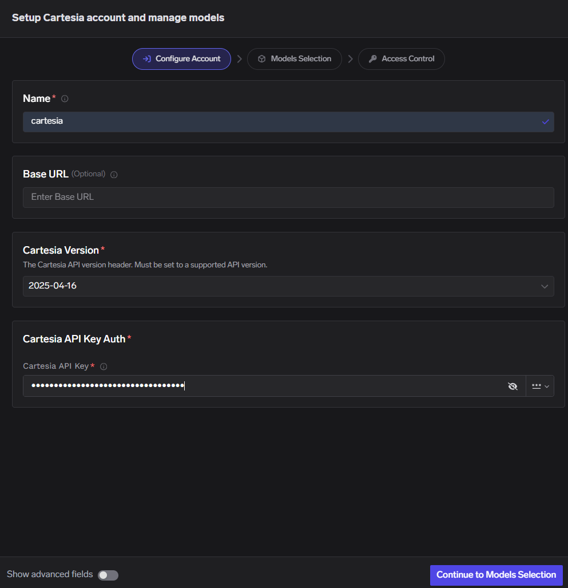
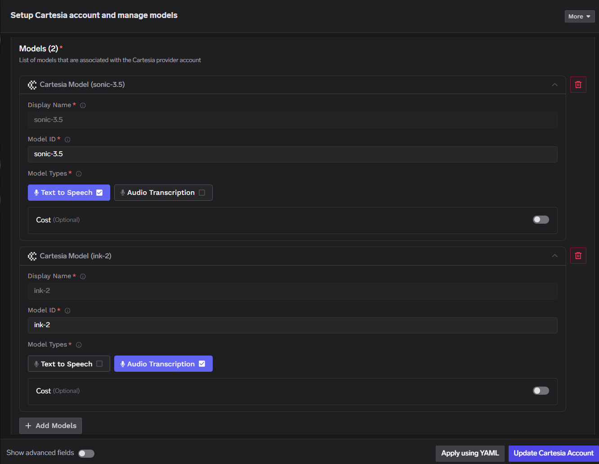

<Note>Community integration by **TrueFoundry**. Last verified: 2026-06-10.</Note>

## Overview

[**TrueFoundry AI Gateway**](https://www.truefoundry.com/ai-gateway) is the proxy layer that sits between your applications and the LLM providers and MCP Servers. It provides a unified OpenAI-compatible API to route requests across 1000+ LLMs while handling observability, governance, and access control at the gateway level.

**Cartesia** is available as a first-party provider in TrueFoundry's AI Gateway for [**TTS and STT**](https://www.truefoundry.com/docs/ai-gateway/cartesia). Register Cartesia models in the gateway, then call them with the Cartesia Python SDK and your TrueFoundry API key.

## Prerequisites

- Sign up for a <a href="https://www.truefoundry.com" target="_blank">TrueFoundry account</a>
- Get a TrueFoundry API key (`TFY_API_KEY`) from <a href="https://www.truefoundry.com/docs/ai-gateway/making-llm-requests-via-gateway" target="_blank">making requests via the gateway</a>
- Get a Cartesia API key from <a href="https://play.cartesia.ai/keys" target="_blank">Cartesia keys</a>
- Python 3.10+

Follow these steps to connect Cartesia in AI Gateway:

<Steps>
  <Step title="Navigate to Cartesia Models in AI Gateway">
    In the TrueFoundry dashboard, go to **AI Gateway** → **Models** and select **Cartesia**. See <a href="https://www.truefoundry.com/docs/ai-gateway/cartesia" target="_blank">TrueFoundry Cartesia setup</a> for the full navigation path.
  </Step>

  <Step title="Add Cartesia Account Details">
    Click **Add Cartesia Account**. Enter a unique account name and your Cartesia **API Key**. Optionally add collaborators so other users or teams can use this account — see <a href="https://www.truefoundry.com/docs/ai-gateway/gateway-access-control" target="_blank">gateway access control</a>.

    <Frame caption="Cartesia Model Account Form">
      
    </Frame>
  </Step>

  <Step title="Add Models">
    Click **+ Add Model** and set **Display name**, **Model ID**, and **Model type**.

    <Frame caption="Add Cartesia Model">
      
    </Frame>

    For Cartesia, **Model ID** and **Display name** must be identical.
  </Step>
</Steps>

## Installation

```bash
pip install cartesia httpx
```

## Quick start

### TTS

Point `AsyncCartesia` at your gateway TTS route. Replace `GATEWAY_BASE_URL`, `cartesiaProviderAccountName`, `TFY_API_KEY`, and `model_id` with values from your TrueFoundry workspace.

```python
import asyncio
import httpx
from cartesia import AsyncCartesia

TFY_API_KEY = "your-tfy-api-key"
BASE_URL = "{GATEWAY_BASE_URL}/tts/{cartesiaProviderAccountName}"
OUTPUT_FILE = "/path/to/output.wav"

client = AsyncCartesia(
    api_key="dummy",  # gateway auth uses x-tfy-api-key, not Cartesia api_key
    base_url=BASE_URL,
    http_client=httpx.AsyncClient(
        headers={"x-tfy-api-key": TFY_API_KEY},
    ),
)


async def main():
    response = await client.tts.generate(
        model_id="sonic-3.5",  # must match a model ID registered in AI Gateway
        transcript="Welcome to Cartesia Sonic!",
        voice={"mode": "id", "id": "a0e99841-438c-4a64-b679-ae501e7d6091"},
        language="en",
        output_format={
            "container": "wav",
            "sample_rate": 44100,
            "encoding": "pcm_s16le",
        },
    )
    with open(OUTPUT_FILE, "wb") as f:
        f.write(await response.read())
    print(OUTPUT_FILE)


asyncio.run(main())
```

| Parameter | Type | Description |
|-----------|------|-------------|
| `GATEWAY_BASE_URL` | `string` | Gateway base URL from TrueFoundry (no trailing slash) |
| `cartesiaProviderAccountName` | `string` | Cartesia provider account name under **AI Gateway** → **Models** → **Cartesia** |
| `TFY_API_KEY` | `string` | TrueFoundry API key sent as the `x-tfy-api-key` header |
| `model_id` | `string` | Cartesia model ID; must match **Model ID** and **Display name** in the gateway |

### STT

Register an STT model type in the gateway, then point `AsyncCartesia` at your gateway STT route. Replace `GATEWAY_BASE_URL`, `cartesiaProviderAccountName`, `TFY_API_KEY`, and `model` with values from your TrueFoundry workspace.

```python
import asyncio
import httpx
from cartesia import AsyncCartesia

TFY_API_KEY = "your-tfy-api-key"
BASE_URL = "{GATEWAY_BASE_URL}/stt/{cartesiaProviderAccountName}"
AUDIO_FILE = "/path/to/audio.wav"

client = AsyncCartesia(
    api_key="dummy",  # gateway auth uses x-tfy-api-key, not Cartesia api_key
    base_url=BASE_URL,
    http_client=httpx.AsyncClient(
        headers={"x-tfy-api-key": TFY_API_KEY},
    ),
)


async def main():
    with open(AUDIO_FILE, "rb") as f:
        response = await client.stt.transcribe(
            file=f,
            model="ink-2",  # must match a model ID registered in AI Gateway
            language="en",
        )
    print(response.text)


asyncio.run(main())
```

| Parameter | Type | Description |
|-----------|------|-------------|
| `GATEWAY_BASE_URL` | `string` | Gateway base URL from TrueFoundry (no trailing slash) |
| `cartesiaProviderAccountName` | `string` | Cartesia provider account name under **AI Gateway** → **Models** → **Cartesia** |
| `TFY_API_KEY` | `string` | TrueFoundry API key sent as the `x-tfy-api-key` header |
| `model` | `string` | Cartesia STT model ID; must match **Model ID** and **Display name** in the gateway |
| `AUDIO_FILE` | `string` | Path to a local audio file (WAV, MP3, and other common formats) |

After models are registered, open any Cartesia model in the TrueFoundry dashboard and use **Code Snippet** or **Try in Playground** to test TTS and STT requests before wiring them into your app.

<CardGroup cols={2}>
  <Card title="TrueFoundry Cartesia setup" icon="book" href="https://www.truefoundry.com/docs/ai-gateway/cartesia">
    Dashboard walkthrough, model configuration, and inference examples.
  </Card>

  <Card title="Gateway access control" icon="book" href="https://www.truefoundry.com/docs/ai-gateway/gateway-access-control">
    Share Cartesia provider accounts with collaborators and teams.
  </Card>
</CardGroup>

## Resources

<CardGroup cols={2}>
  <Card title="Making requests via the gateway" icon="book" href="https://www.truefoundry.com/docs/ai-gateway/making-llm-requests-via-gateway">
    Gateway base URL and TrueFoundry API keys.
  </Card>

  <Card title="Cartesia TTS API reference" icon="book" href="https://docs.cartesia.ai/api-reference/tts/tts">
    Cartesia TTS HTTP API reference.
  </Card>

  <Card title="Cartesia STT API reference" icon="book" href="https://docs.cartesia.ai/api-reference/stt/transcribe">
    Cartesia batch STT HTTP API reference.
  </Card>
</CardGroup>
